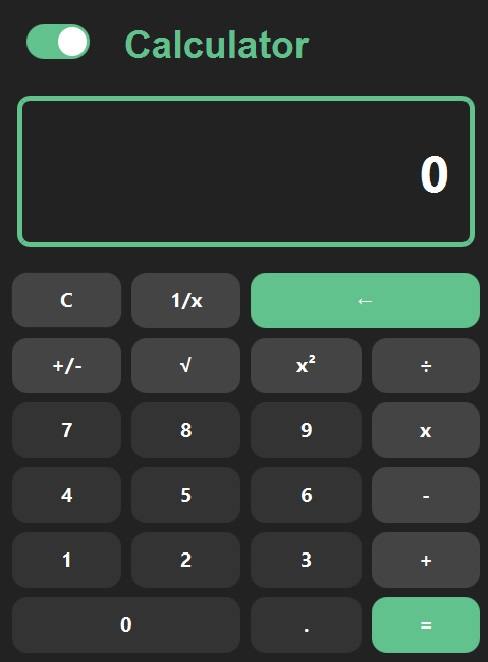
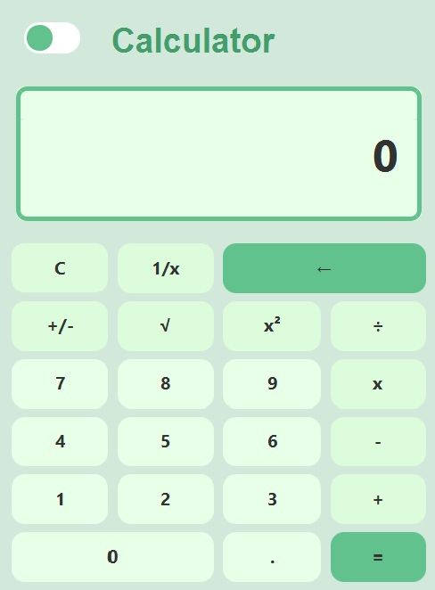

<div align="center"> 
    
</div>

# Responsive Calculator
This is a full stack application created during the second semester of Computer Science studies at Warsaw University of Technology.<br>
The main function is to (surprisingly) perform mathematical operations but when the User expands the window he will be able to check the current exchange rates. 

# Installation
Clone the repository locally:
```shell
git clone https://github.com/mausor11/Responsive_Calculator.git
```
# Getting Started
To run the application go to <b>"app"</b> folder and run the <b>Calculator.jar</b> file.

# Technology Stack
### FrontEnd
* JavaFX 20
### BackEnd
* Java JDK 19.0.2.
* JSoup (for Web Scraping)

# Screenshots
<div>
    
    
</div>

